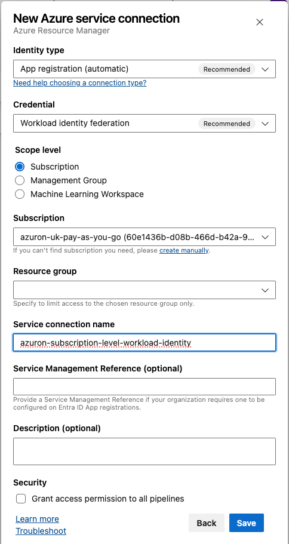
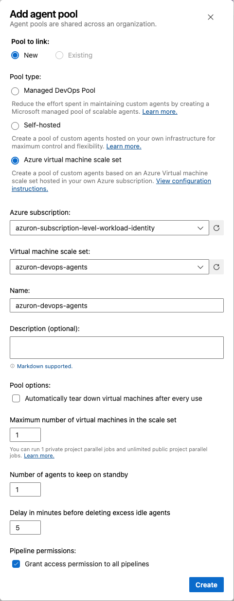
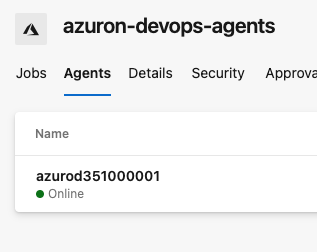
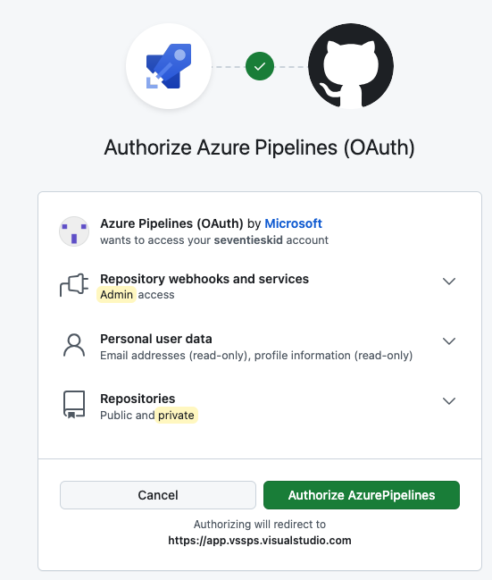
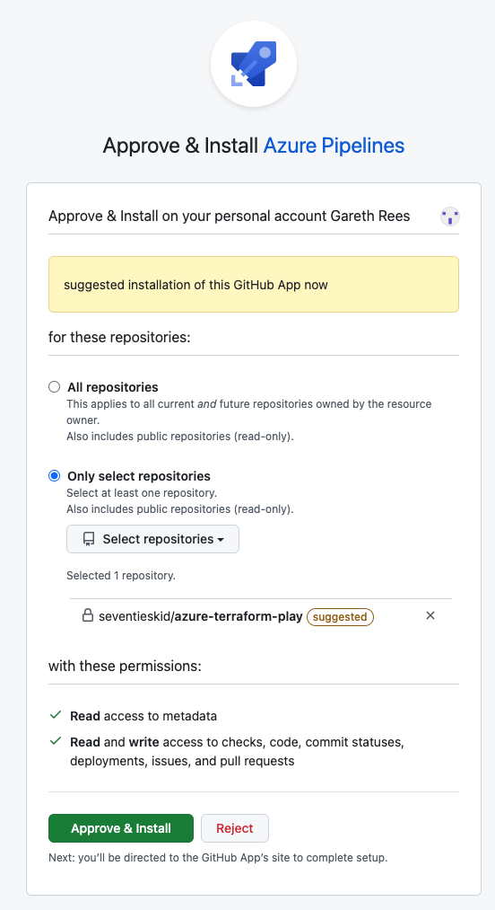
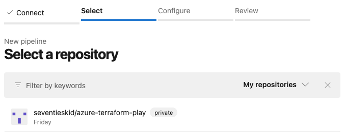
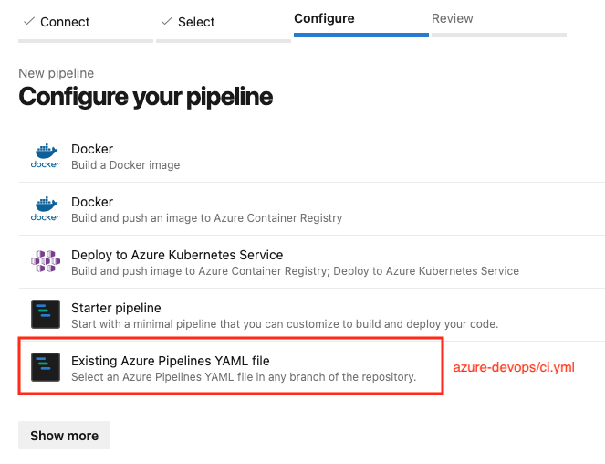

# Authenticate As Human Using CLI

GCP: gcloud auth login
AZURE: az login

# Microsoft Entra

Azure subscription and Azure DevOps Org connected to same Microsoft Entra, Default Directory

# Bootstrap Azure: Create Resource Group
```
az group create \
--location westeurope \
--name azuron-devops-agents
```

# Bootstrap Azure: Create Container Registry
```
az acr create --resource-group azuron-devops-agents --name azuron --sku Basic

az acr identity assign --identities "[system]" \
                       --name azuron \
                       --resource-group azuron-devops-agents

# Assignee is the principal id from the above command
az role assignment create --assignee 4903a65f-2b28-41f1-aa50-79eb37e6262f \
--role AcrPull \
--scope "/subscriptions/60e1436b-d08b-466d-b42a-98011fed3eb2"

# Build and push pipeline image to ACR
az acr login -n azuron.azurecr.io
docker build -t azuron.azurecr.io/azure-cli-terraform:0.0.1 .
docker push azuron.azurecr.io/azure-cli-terraform:0.0.1
```

# Bootstrap Azure: Self Hosted Pipeline Setup on Virtual Machine Scaling Sets

Level: Subscription
As role: Owner

```
# With private IP
az vmss create \
--name azuron-devops-agents \
--resource-group azuron-devops-agents \
--image Ubuntu2204 \
--authentication-type SSH \
--admin-username grees \
--generate-ssh-keys \
--instance-count 1 \
--disable-overprovision \
--upgrade-policy-mode manual \
--single-placement-group false \
--platform-fault-domain-count 1 \
--load-balancer "" \
--custom-data /Users/garethrees/gitrepos/azure-terraform-play/cloud-config.yml \
--orchestration-mode Uniform

# Public IP
#az vmss create \
#   --name azuron-devops-agents \
#   --resource-group azuron-devops-agents \
#   --image Ubuntu2204 \
#   --custom-data /Users/garethrees/gitrepos/azure-terraform-play/cloud-config.yml \
#   --admin-username azuron \
#   --authentication-type SSH \
#   --generate-ssh-keys \
#   --instance-count 1 \
#   --disable-overprovision \
#   --upgrade-policy-mode manual \
#   --single-placement-group false \
#   --platform-fault-domain-count 1 \
#   --orchestration-mode Uniform

# SSH into public instance
# ssh azuron@20.234.132.131 -p 50000
# Az DevOps command to add agent pool goes here
# /agent directory only pops up after around 10 minutes after creating pool with VMSS

# Create and assign user managed identity to VM Scale Set
az identity create --name azuron-devops-agents --resource-group azuron-devops-agents
# Manually for now drop client id into ci.yaml

# Assignee is the principalId from identity creation
az role assignment create --assignee 23d6202e-42d4-4ad7-b8ba-9a9fbcfb2212 \
--role Owner \
--scope "/subscriptions/60e1436b-d08b-466d-b42a-98011fed3eb2"

az vmss identity assign \
--identities azuron-devops-agents \
--name azuron-devops-agents \
--resource-group azuron-devops-agents

az vmss update-instances -g azuron-devops-agents -n azuron-devops-agents --instance-ids 0

```

# Bootstrap Azure DevOps: Create Service Connection to Azure Subscription

Level: Azure DevOps Project
As role: Owner

Project Settings --> Pipelines --> Service connections --> New Service connection --> Azure Resource Manager



# Bootstrap Azure DevOps: Create Service Connection to Azure Container Registry

Level: Azure DevOps Project
As role: Owner

Project Settings --> Pipelines --> Service connections --> New Service connection --> Docker Registry

???

# Bootstrap Azure DevOps: Self Hosted Pipeline Setup

Level: Azure DevOps Project
As role: Owner

Project Settings --> Pipelines --> Agent pools --> Add pool --> Azure virtual machine scale set



NOTE: It takes around 30 mins for the VMSS to start registering agents in the Agents tab of the Agent pool. See below:-



Pipelines cannot be executed until that is completed.

Azure DevOps is automatically installing additional agent software on the self-hosted VMs to register them as Azure DevOps agents.

# Bootstrap Azure Devops: Parallel Jobs

Level: Azure DevOps Project
As role: Owner

How many jobs should run in parallel on your self-hosted Azure DevOps agents ?

NOTE NOTE: You will need 1 x VM for EACH PARALLEL JOB. 

Azure DevOps does not run multiple pipelines simultaneously on a single VM

So you will need to have a VM Scaling Set that will scale to the same number as your parallel jobs set here

Project Settings --> Pipelines --> Parallel Jobs --> Self Hosted --> Change --> Self Hosted (CI/CD) = NO. OF PARALLEL JOBs REQUIRED

# Bootstrap Azure Devops: Create Pipeline (Different for GitHub Enterprise)

Level: Azure DevOps Project
As role: Project Administrator Group

Pipelines --> Create Pipeline --> GitHub



 




 

# DELETE ALL RESOURCES

```
az group delete --name azuron-devops-agents

az group delete --name terraform-test-rg
```